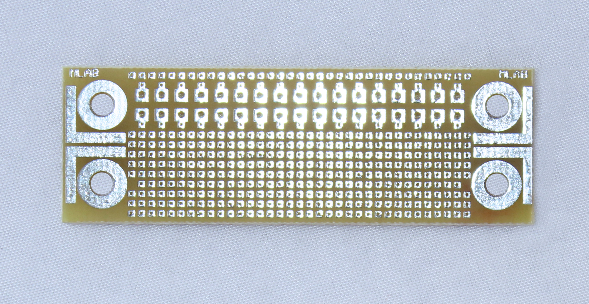

# UNIUNI03A - Universal Breadboard PCB for MLAB Kit System

## Description
The UNIUNI03A is a small universal PCB with a pad spacing of 1.27mm. It can be cut to the desired length as needed, making it suitable primarily for SMD components.

## Features
- Universal PCB with 1.27mm pad spacing
- Customizable length
- Optimized for SMD components

## Purchase Information
The UNIUNI03A module can be purchased from [Tindie store](https://www.tindie.com/products/35139/).

## Additional Resources
For more details, refer to the [MLAB Wiki](https://wiki.mlab.cz/doku.php?id=en:start).
